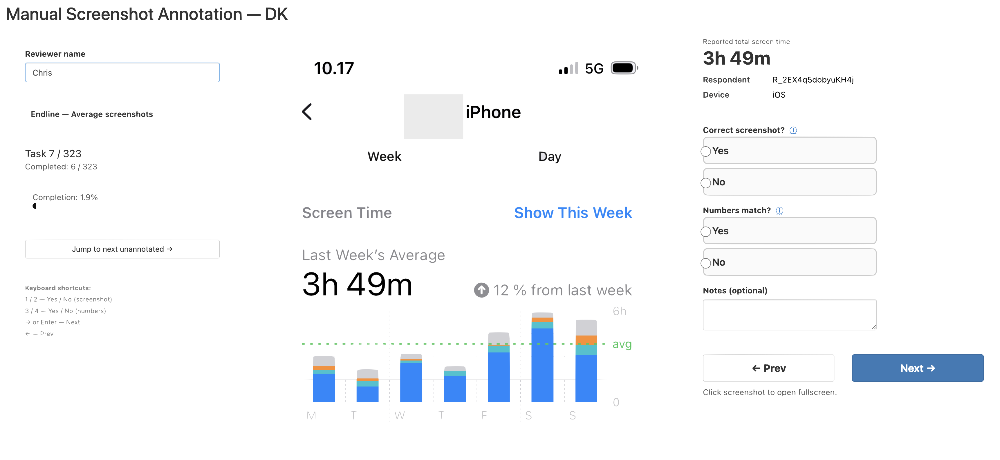
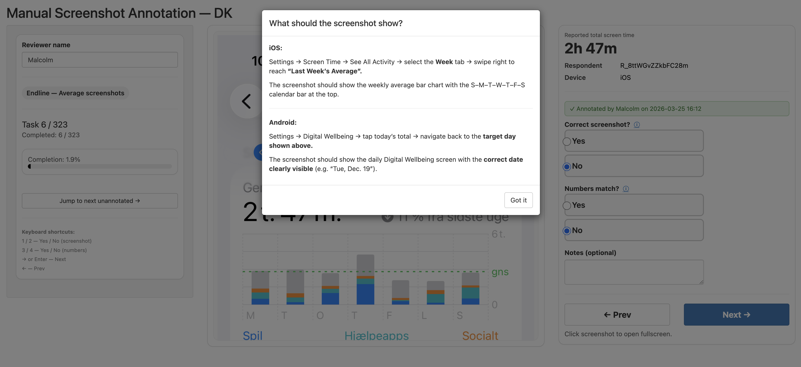
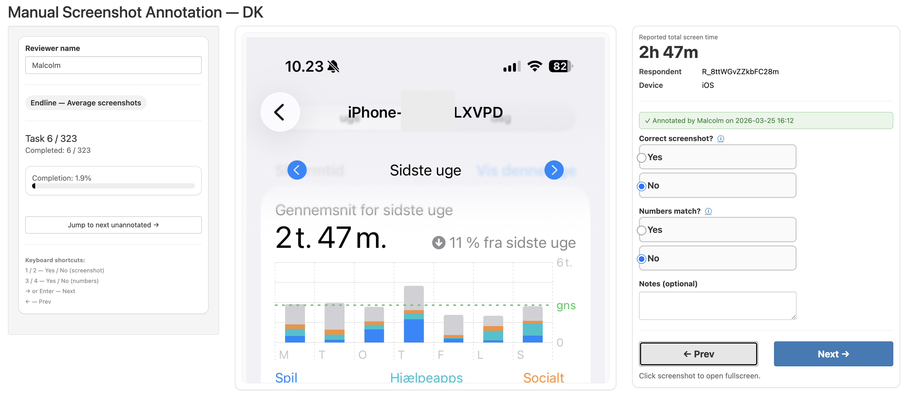

# Screenshot Compliance Check — Country Team Guide

This guide walks you through everything you need to do after receiving your data package from Chris.

**Your job in brief:** receive a data package, verify it, annotate screenshots in the app, then send the results back.

---

## How this fits in the full pipeline

This repository contains only the scripts your team needs. Chris manages the full pipeline separately. Here is where your work fits:

> **Team tip:** If your team includes members with varying R experience, it helps to have someone more comfortable with R lead the setup steps and be on hand to answer questions.

| Step | Who | What |
|---|---|---|
| 1–2 | Chris | Downloads Qualtrics data and packages it into a ZIP for your team |
| 3 | Chris | Shares the ZIP with you via Box |
| **4** | **You** | **Download this repository, unzip the data into it, run `00_check_setup.R`** |
| **5** | **You** | **Annotate all screenshots in `03_run_app.R`** |
| **6** | **You** | **Bundle and submit results via `04_bundle_results.R`** |
| 7+ | Chris | Runs automated checks and produces the final compliance report |

**Important:** You will never see the raw Qualtrics survey data. Your data package contains only the screenshot images and a task list — no personally identifiable survey responses.

---

## Contents

1. [One-time setup](#1-one-time-setup)
2. [Receive and unzip your data package](#2-receive-and-unzip-your-data-package)
3. [Step 1 — Verify your setup](#3-step-1--verify-your-setup)
4. [Step 2 — Annotate screenshots](#4-step-2--annotate-screenshots)
5. [Step 3 — Bundle and submit](#5-step-3--bundle-and-submit)
6. [Folder structure](#6-folder-structure)
7. [Troubleshooting](#7-troubleshooting)

---

## 1. One-time setup

Do this section once, before running anything else.

### 1a. Install R

If R is not already installed on your computer, download and install it from:

- **R:** https://cran.r-project.org
- **RStudio** (recommended, makes running scripts easier): https://posit.co/download/rstudio-desktop/

### 1b. Install required R packages

You do not need to install any packages manually. When you run `00_check_setup.R` (Step 1 below), it automatically checks which packages are required and installs any that are missing on your computer before doing anything else.

### 1c. Get this code repository

If you have not already, download this repository to your computer. The easiest way is to click the green **Code** button on GitHub and choose **Download ZIP**, then unzip it somewhere convenient (e.g. your Desktop or Documents folder).

---

## 2. Receive and unzip your data package

Chris will send you a **Box link** to a single ZIP file containing data for both waves (baseline and endline). The file is named something like:

```
annotation_data_GB_20260115_143022.zip
```

**Important:** move the ZIP file into the **root folder of this repository** (the same folder that contains the `.R` scripts) before unzipping. Then double-click the ZIP to unzip it in place.

After unzipping correctly, your folder should look like this:

```
GSME_compliance_public/        ← the repository folder
  00_check_setup.R
  03_run_app.R
  04_bundle_results.R
  README.md
  data/                        ← created by unzipping
    qualtrics/
      GB/                      ← your country code
        baseline/
        endline/
```

If you see a `data/` folder sitting alongside the `.R` scripts, you have done it correctly.

> **Common mistake:** unzipping onto your Desktop or Downloads folder and then moving only the inner files. Always move the ZIP itself into the repository folder first, then unzip.

---

## 3. Step 1 — Verify your setup

**Script:** `00_check_setup.R`

Run this immediately after unzipping. It will:
- Automatically install any missing R packages
- Confirm that all required files and screenshots are present

### How to run it

1. Open `00_check_setup.R` in RStudio
2. Set your working directory to this project folder: in RStudio, go to **Session > Set Working Directory > To Source File Location**
3. Find the line near the top that reads `TEAM_SLUG` and change it to your ISO2 country code:

```r
TEAM_SLUG <- "GB"
```

4. Click **Source** (or press **Ctrl+Shift+Enter** on Windows / **Cmd+Shift+Enter** on Mac) to run the whole script

### What a passing result looks like

```
Checking setup for team: GB
--------------------------------------------------

[BASELINE]
  ✅ Found: data/qualtrics/GB/baseline/derived/average_screentime_for_annotation.csv
  ✅ Found: data/qualtrics/GB/baseline/derived/app_screentime_for_annotation.csv
  ✅ average_screentime_for_annotation.csv: 412 screenshots, all present
  ✅ app_screentime_for_annotation.csv: 412 screenshots, all present

[ENDLINE]
  ...
--------------------------------------------------

✅ All checks passed. You are ready to annotate.
   Next step: open 03_run_app.R and run it.
```

If anything is missing, the script will tell you exactly what is wrong. Contact Chris (cb5691@nyu.edu) with the output and he will resend the data.

---

## 4. Step 2 — Annotate screenshots

**Script:** `03_run_app.R`

### What it does

Opens an interactive browser-based app where you review and annotate screenshots uploaded by respondents.

### How to run it

1. Open `03_run_app.R` in RStudio
2. Find the line near the top that reads `TEAM_SLUG` and change it to your ISO2 country code:

```r
TEAM_SLUG <- "GB"
```

3. Click **Source** (or press **Ctrl+Shift+Enter** on Windows / **Cmd+Shift+Enter** on Mac) to run the script

A browser window opens automatically. If it does not, look for a URL printed in the console (e.g. `http://127.0.0.1:XXXX`) and open it manually.

### What the app looks like



*The main annotation screen. The respondent's screenshot appears on the left. The right panel shows reported screen time values to compare against, followed by the two Yes/No questions. The left sidebar shows your current phase, task number, and overall completion progress.*

### First time setup in the app

Enter your **name** in the Reviewer name field in the top-left sidebar. This is required before you can save any annotations and is used to track who annotated what.

### What you will annotate

The app works through four phases in order:

1. **Baseline — average screenshots** (total screen time)
2. **Baseline — app-level screenshots** (per-app breakdown)
3. **Endline — average screenshots** (total screen time)
4. **Endline — app-level screenshots** (per-app breakdown)

You cannot skip ahead to a later phase until the earlier one is complete. Baseline tasks only include participants who also completed the endline survey.

### For each screenshot, answer two questions

**1. Correct screenshot?**

Is this the right type of screenshot? Click the **ⓘ** icon next to this question at any time to see exactly what each screenshot should look like for iOS and Android.



*Clicking the ⓘ icon opens a guidance panel with device-specific instructions for what the screenshot should show.*

In brief:
- **iOS average:** Screen Time weekly summary showing "Last Week's Average" bar chart (S–M–T–W–T–F–S)
- **iOS app-level:** Screen Time scrolled down to show individual apps used for **35 minutes or more** last week
- **Android average:** Digital Wellbeing daily view for the specific target date shown on screen
- **Android app-level:** Digital Wellbeing scrolled down to show individual apps used for **5 minutes or more** on that day

**2. Numbers match?**

Do the numbers in the screenshot match the values reported by the respondent (shown on the right-hand panel)? Click the **ⓘ** icon for guidance on what to check.

Answer **Yes** or **No** for both questions. Add an optional note if needed.

### Navigation

- Click **Next** to save your answers and move to the next task
- Click **Prev** to go back and change a previous annotation
- Use **Jump to next unannotated** in the sidebar to skip to the first task without an answer
- You **must** answer both questions before Next will save

> You cannot proceed without entering your reviewer name and answering both questions.

### Keyboard shortcuts

| Key | Action |
|---|---|
| `1` | Yes — correct screenshot |
| `2` | No — correct screenshot |
| `3` | Yes — numbers match |
| `4` | No — numbers match |
| `→` or Enter | Next |
| `←` | Prev |

### Multiple annotators

The app supports multiple team members annotating in shifts. Each person:

1. Enters their own name in the Reviewer name field
2. The app automatically resumes at the first unannotated task

This means annotators can divide the workload without duplicating effort or losing any work. Previously annotated tasks show a green badge with the name and time of whoever completed them.



*When you navigate to a task that another team member has already annotated, a green badge appears showing their name and the time of annotation. Their answers are pre-filled so you can review or correct them if needed.*

### Progress is always saved

You can close and re-open the app at any time. All annotations are written to disk immediately when you click Next. When you re-open the app, it picks up exactly where you left off.

### Outputs

```
data/qualtrics/<TEAM_SLUG>/<WAVE>/results/sample_avg.csv       — task list (average)
data/qualtrics/<TEAM_SLUG>/<WAVE>/results/sample_app.csv       — task list (app-level)
data/qualtrics/<TEAM_SLUG>/<WAVE>/results/annotations_avg.csv  — latest annotation per task (average)
data/qualtrics/<TEAM_SLUG>/<WAVE>/results/annotations_app.csv  — latest annotation per task (app-level)
data/qualtrics/<TEAM_SLUG>/<WAVE>/results/audit_log_avg.csv    — full annotation history (average)
data/qualtrics/<TEAM_SLUG>/<WAVE>/results/audit_log_app.csv    — full annotation history (app-level)
```

---

## 5. Step 3 — Bundle and submit

**Script:** `04_bundle_results.R`

### What it does

Packages your annotation files into ZIP files ready for submission.

### How to run it

1. Open `04_bundle_results.R` in RStudio
2. Find the line near the top that reads `TEAM_SLUG` and change it to your ISO2 country code:

```r
TEAM_SLUG <- "GB"
```

3. Click **Source** (or press **Ctrl+Shift+Enter** on Windows / **Cmd+Shift+Enter** on Mac) to run the script

### Outputs

Two ZIP files, one per wave:

```
data/qualtrics/<TEAM_SLUG>/baseline/results/bundle_<TEAM_SLUG>_baseline_<timestamp>.zip
data/qualtrics/<TEAM_SLUG>/endline/results/bundle_<TEAM_SLUG>_endline_<timestamp>.zip
```

### Submit

Upload both ZIPs using this form: **https://forms.gle/szGhMHymtzTqEEjh8**

---

## 6. Folder structure

After running all scripts, your directory will look like this:

```
data/
  qualtrics/
    <TEAM_SLUG>/
      baseline/
        uploads/
          <ResponseId>/
            <screenshot files>
        derived/
          average_screentime_for_annotation.csv
          app_screentime_for_annotation.csv
        results/
          sample_avg.csv
          sample_app.csv
          annotations_avg.csv
          annotations_app.csv
          audit_log_avg.csv
          audit_log_app.csv
          bundle_<TEAM_SLUG>_baseline_<timestamp>.zip   ← submit this
      endline/
        ... same structure ...
```

---

## 7. Troubleshooting

**`TEAM_SLUG is blank`** — Open the script and set `TEAM_SLUG` to your ISO2 country code (e.g. `"GB"`).

**`00_check_setup.R` reports missing files** — You may have unzipped the data package into the wrong location, or unzipped it into a subfolder. Move the ZIP file into the project folder (alongside the `.R` scripts) and unzip it there. If the problem persists, contact Chris.

**`No usable avg screenshots found on disk`** — The data package may be incomplete. Re-download the ZIP from the Box link Chris sent and unzip again.

**App shows no screenshots** — Make sure `00_check_setup.R` passed and the `derived/` folder exists for your team.

**A specific screenshot is blank or missing** — The file for that task may be missing or corrupted in the data package. Note this in the Notes field (e.g. "screenshot file missing"), select No for both questions, and continue. Flag it to Chris when you submit.

**Reviewer name warning when clicking Next** — Enter your name in the Reviewer name field in the sidebar before annotating.

**App always starts at task 1 instead of resuming** — This means the annotation files do not exist yet, or you deleted them. Once you have saved at least one annotation, the app will resume correctly on next launch.

**Warning about incomplete annotations when bundling** — The script detected that not all tasks have been annotated. Return to `03_run_app.R`, use **Jump to next unannotated** in the sidebar to find any remaining tasks, and complete them before re-running `04_bundle_results.R`.

**Want to redo the task list** — Delete `results/sample_avg.csv` and/or `results/sample_app.csv`, then open and re-run `03_run_app.R`. This regenerates the task list from scratch. Any existing annotations in `annotations_*.csv` are preserved.

**Script errors about missing packages** — Run `install.packages("packagename")` for any package mentioned in the error, then re-run the script. For package conflicts or more complex errors, pasting the error message into an AI assistant (e.g. Claude at claude.ai) is often the fastest way to diagnose and fix the problem.

**Any other problem** — Contact Chris (cb5691@nyu.edu) and include the full error message from your console.
