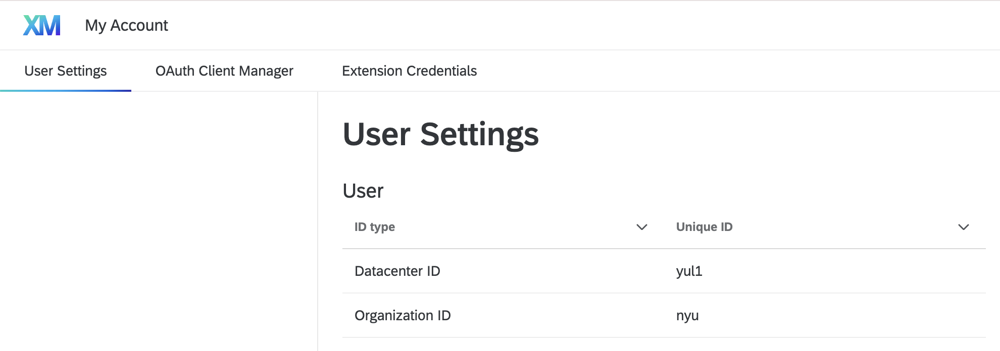
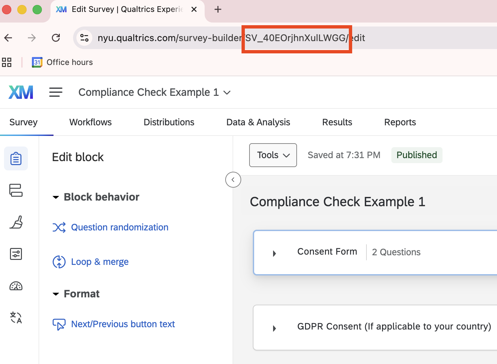

# Screenshot Compliance Check — Country Team Guide

This guide walks you through everything you need to do, from first-time setup to submitting your results. No prior experience is assumed.

**Your job in brief:** download your survey data from Qualtrics, run three short scripts to prepare and annotate it, then send the results back.

---

## Contents

1. [One-time setup](#1-one-time-setup)
2. [Before you start each wave](#2-before-you-start-each-wave)
3. [Step 1 — Download survey data](#3-step-1--download-survey-data)
4. [Step 2 — Prepare data for annotation](#4-step-2--prepare-data-for-annotation)
5. [Step 3 — Annotate screenshots](#5-step-3--annotate-screenshots)
6. [Step 4 — Bundle and submit](#6-step-4--bundle-and-submit)
7. [Folder structure](#7-folder-structure)
8. [Troubleshooting](#8-troubleshooting)

---

## 1. One-time setup

Do this section once, before running anything else.

### 1a. Install R

If R is not already installed on your computer, download and install it from:

- **R:** https://cran.r-project.org
- **RStudio** (recommended, makes running scripts easier): https://posit.co/download/rstudio-desktop/

### 1b. Install required R packages

Open R or RStudio and run this once:

```r
install.packages(c(
  "qualtRics", "httr", "readr", "dplyr", "stringr", "tidyr", "shiny", "tibble"
))
```

This only needs to be done once per computer.

### 1c. Set your Qualtrics API key

You need an API key to download data from Qualtrics. To find yours:

1. Log in to Qualtrics
2. Click your account icon (top right) → **Account Settings**
3. Go to the **Qualtrics IDs** tab
4. Copy the value under **API Token**

Now save it so R can find it. The easiest way is to open your `.Renviron` file:

```r
usethis::edit_r_environ()
```

Add this line (replacing `YOUR_KEY_HERE` with your actual key):

```
QUALTRICS_API_KEY=YOUR_KEY_HERE
```

Save the file, then **restart R**.

> If `usethis` is not installed, run `install.packages("usethis")` first.

### 1d. Find your Qualtrics data center

Each script has a line near the top:

```r
BASE_URL <- "ca1.qualtrics.com"
```

You need to change this to match your Qualtrics account. To find your data center:

1. In Qualtrics, go to **Account Settings → User Settings**
2. Look for **Datacenter ID**



*The screenshot above shows the Qualtrics User Settings page. Your Datacenter ID appears in the top section — in this example it is `yul1`, so `BASE_URL` should be `"yul1.qualtrics.com"`.*

---

## 2. Before you start each wave

### 2a. Find your Survey IDs

Each survey has a unique ID that starts with `SV_`. You can find it in the survey URL when you open it in Qualtrics:



You will need the IDs for both your **baseline** and **endline** surveys.

### 2b. Find your participant ID column name

Your panel provider assigns each participant a stable ID that is the same across both surveys. You need to know what this column is called in your Qualtrics data (e.g. `"ID"`, `"PanelID"`, `"PROLIFIC_PID"`).

If you are unsure, download your survey responses from Qualtrics as a CSV and look at the column headers.

---

## 3. Step 1 — Download survey data

**Script:** `01_download.R`

### What it does

Downloads all survey responses and uploaded screenshot files from Qualtrics for both waves.

### How to run it

1. Open `01_download.R` in RStudio (or any text editor)
2. Find the `CONFIG` section near the top and fill in:

```r
BASE_URL  <- "yul1.qualtrics.com"  # your Qualtrics data center (see section 1d)
TEAM_SLUG <- "GB"                  # your ISO2 country code

SURVEY_IDS <- list(
  endline  = "SV_xxxxxxxxxx",  # your endline survey ID
  baseline = "SV_xxxxxxxxxx"   # your baseline survey ID
)
```

3. Run the script. In RStudio, click **Source**, or from the terminal:

```bash
Rscript 01_download.R
```

### What you will see

The script downloads both waves automatically. For each wave it prints progress as it downloads each respondent's files. This may take a while if there are many respondents.

### Outputs

For each wave (`baseline` and `endline`):

```
data/qualtrics/<TEAM_SLUG>/<WAVE>/responses.csv
data/qualtrics/<TEAM_SLUG>/<WAVE>/uploaded_files_manifest.csv
data/qualtrics/<TEAM_SLUG>/<WAVE>/uploads/<ResponseId>/  (screenshot image files)
```

> **If interrupted:** re-running the script will skip files that already downloaded. Set `FORCE_UPLOADS <- TRUE` to re-download everything.

---

## 4. Step 2 — Prepare data for annotation

**Script:** `02_wrangle.R`

### What it does

Reads the downloaded data and produces clean, annotation-ready CSV files for both waves.

### How to run it

1. Open `02_wrangle.R`
2. Fill in the `CONFIG` section:

```r
TEAM_SLUG         <- "GB"   # same as Step 1
PARTICIPANT_ID_COL <- "ID"  # column name containing your panel provider's participant ID
```

> Set `PARTICIPANT_ID_COL` to the name of the column that holds the **stable participant ID** from your panel provider — the ID that is the same in both the baseline and endline surveys. If you do not have one, set it to `NA`.

3. Run the script:

```bash
Rscript 02_wrangle.R
```

### Outputs

For each wave:

```
data/qualtrics/<TEAM_SLUG>/<WAVE>/derived/average_screentime_for_annotation.csv
data/qualtrics/<TEAM_SLUG>/<WAVE>/derived/app_screentime_for_annotation.csv
```

---

## 5. Step 3 — Annotate screenshots

**Script:** `03_run_app.R`

### What it does

Opens an interactive browser-based app where you review and annotate screenshots uploaded by respondents.

### How to run it

1. Open `03_run_app.R`
2. Set `TEAM_SLUG`:

```r
TEAM_SLUG <- "GB"
```

3. Run the script:

```bash
Rscript 03_run_app.R
```

A browser window opens automatically. If it does not, look for a URL printed in the console (e.g. `http://127.0.0.1:XXXX`) and open it manually.

### What the app looks like


*The main annotation screen. The respondent's screenshot appears on the left. The right panel shows reported screen time values to compare against, followed by the two Yes/No questions. The left sidebar shows your current phase, task number, and overall completion progress.*

### First time setup in the app

Enter your **name** in the Reviewer name field in the top-left sidebar. This is required before you can save any annotations and is used to track who annotated what.

### What you will annotate

The app works through four phases in order:

1. **Endline — average screenshots** (total screen time)
2. **Endline — app-level screenshots** (per-app breakdown)
3. **Baseline — average screenshots**
4. **Baseline — app-level screenshots**

You cannot skip ahead to a later phase until the earlier one is complete. Baseline tasks only include participants who also completed the endline survey.

### For each screenshot, answer two questions

**1. Correct screenshot?**

Is this the right type of screenshot? Click the **ⓘ** icon next to this question at any time to see exactly what each screenshot should look like for iOS and Android.


*Clicking the ⓘ icon opens a guidance panel with device-specific instructions for what the screenshot should show.*

In brief:
- **iOS average:** Screen Time weekly summary showing "Last Week's Average" bar chart (S–M–T–W–T–F–S)
- **iOS app-level:** Screen Time scrolled down to show individual apps
- **Android average:** Digital Wellbeing daily view for the specific target date shown on screen
- **Android app-level:** Digital Wellbeing scrolled down to show individual apps for that day

**2. Numbers match?**

Do the numbers in the screenshot match the values reported by the respondent (shown on the right-hand panel)? Click the **ⓘ** icon for guidance on what to check.

Answer **Yes** or **No** for both questions. Add an optional note if needed.

### Navigation

- Click **Next** to save your answers and move to the next task
- Click **Prev** to go back and change a previous annotation
- Use **Jump to next unannotated** in the sidebar to skip to the first task without an answer
- You **must** answer both questions before Next will save

> You cannot proceed without entering your reviewer name and answering both questions.

### Keyboard shortcuts

| Key | Action |
|---|---|
| `1` | Yes — correct screenshot |
| `2` | No — correct screenshot |
| `3` | Yes — numbers match |
| `4` | No — numbers match |
| `→` or Enter | Next |
| `←` | Prev |

### Multiple annotators

The app supports multiple team members annotating in shifts. Each person:

1. Enters their own name in the Reviewer name field
2. The app automatically resumes at the first unannotated task

This means annotators can divide the workload without duplicating effort or losing any work. Previously annotated tasks show a green badge with the name and time of whoever completed them.


*When you navigate to a task that another team member has already annotated, a green badge appears showing their name and the time of annotation. Their answers are pre-filled so you can review or correct them if needed.*

### Progress is always saved

You can close and re-open the app at any time. All annotations are written to disk immediately when you click Next. When you re-open the app, it picks up exactly where you left off.

### Outputs

```
data/qualtrics/<TEAM_SLUG>/<WAVE>/results/sample_avg.csv       — task list (average)
data/qualtrics/<TEAM_SLUG>/<WAVE>/results/sample_app.csv       — task list (app-level)
data/qualtrics/<TEAM_SLUG>/<WAVE>/results/annotations_avg.csv  — latest annotation per task (average)
data/qualtrics/<TEAM_SLUG>/<WAVE>/results/annotations_app.csv  — latest annotation per task (app-level)
data/qualtrics/<TEAM_SLUG>/<WAVE>/results/audit_log_avg.csv    — full annotation history (average)
data/qualtrics/<TEAM_SLUG>/<WAVE>/results/audit_log_app.csv    — full annotation history (app-level)
```

---

## 6. Step 4 — Bundle and submit

**Script:** `04_bundle_results.R`

### What it does

Packages your annotation files into ZIP files ready for submission.

### How to run it

1. Open `04_bundle_results.R`
2. Set `TEAM_SLUG`:

```r
TEAM_SLUG <- "GB"
```

3. Run the script:

```bash
Rscript 04_bundle_results.R
```

### Outputs

Two ZIP files, one per wave:

```
data/qualtrics/<TEAM_SLUG>/baseline/results/bundle_<TEAM_SLUG>_baseline_<timestamp>.zip
data/qualtrics/<TEAM_SLUG>/endline/results/bundle_<TEAM_SLUG>_endline_<timestamp>.zip
```

### Submit

Upload both ZIPs using this form: **https://forms.gle/szGhMHymtzTqEEjh8**

---

## 7. Folder structure

After running all scripts, your directory will look like this:

```
data/
  qualtrics/
    <TEAM_SLUG>/
      baseline/
        responses.csv
        uploaded_files_manifest.csv
        uploads/
          <ResponseId>/
            <screenshot files>
        derived/
          average_screentime_for_annotation.csv
          app_screentime_for_annotation.csv
        results/
          sample_avg.csv
          sample_app.csv
          annotations_avg.csv
          annotations_app.csv
          audit_log_avg.csv
          audit_log_app.csv
          bundle_<TEAM_SLUG>_baseline_<timestamp>.zip   ← submit this
      endline/
        ... same structure ...
```

---

## 8. Troubleshooting

**`TEAM_SLUG is blank`** — Open the script and set `TEAM_SLUG` to your ISO2 country code (e.g. `"GB"`).

**`Missing QUALTRICS_API_KEY`** — Follow section 1c to set your API key and restart R.

**`One or both SURVEY_IDS are blank`** — Open `01_download.R` and fill in your survey IDs in the CONFIG section.

**`No usable avg screenshots found on disk`** — The screenshot download may have failed. Re-run `01_download.R` with `FORCE_UPLOADS <- TRUE` at the top of the script.

**App shows no screenshots** — Make sure `02_wrangle.R` completed successfully and the `derived/` folder exists for your team.

**Reviewer name warning when clicking Next** — Enter your name in the Reviewer name field in the sidebar before annotating.

**App always starts at task 1 instead of resuming** — This means the annotation files do not exist yet, or you deleted them. Once you have saved at least one annotation, the app will resume correctly on next launch.

**Want to redo the task list** — Delete `results/sample_avg.csv` and/or `results/sample_app.csv`, then re-run `03_run_app.R`. This regenerates the task list from scratch. Any existing annotations in `annotations_*.csv` are preserved.

**`No baseline respondents matched any endline participant_id`** — Check that `PARTICIPANT_ID_COL` is set to the correct column name in `02_wrangle.R`, and that both waves have been wrangled.

**Script errors about missing packages** — Run `install.packages("packagename")` for any package mentioned in the error, then re-run the script.
